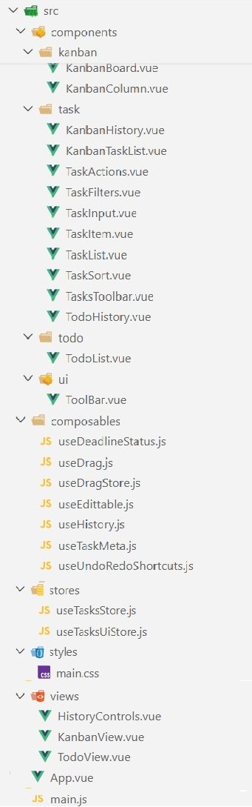

# 📌 Todo/Kanban App

Приложение объединяет два режима работы с задачами:

- классический Todo список
- Kanban-доску

Позволяет гибко управлять задачами и отслеживать изменения через историю (undo/redo).

---

## 🚀 Функциональность

- Управление колонками
- Добавление задач с дедлайнами
- Редактирование задач (dblclick)
- Отметка выполнения (checkbox)
- Фильтрация:
  - Активные
  - Выполненные
  - Важные
  - Отложенные
- Сортировка:
  - По важности
  - По дедлайну
- Поиск по задачам
- Drag & Drop (колонки и задачи)
- Раздельная история действий для Todo и Kanban (undo / redo)
- Две независимые системы истории (Todo / Kanban)
- Частичный undo (только для задач Todo)
- Сохранение состояния (localStorage)
- Счетчик для уменьшения истории
- Просмотр истории

---

## ⌨️ Горячие клавиши

- Ctrl + Z — undo
- Ctrl + Y — redo
- Enter — сохранить редактирование
- Esc — отменить редактирование

---

## 🛠 Технологии

- Vue 3 (Composition API)
- Pinia (state management)
- Vite (build tool)
- JavaScript (ES6+)
- CSS

---

## 📸 Скриншот



---

## ▶️ Запуск проекта

1. Установить зависимости:

```bash
npm install
```

2. Запустить проект:

```bash
   npm run dev
```

3. Открыть в браузере:

```
   http://localhost:5173
```

(порт может отличаться)

## 🧠 Архитектура

### Views

- TodoView — режим списка задач
- KanbanView — режим доски

### Stores

- useTasksStore — задачи + история
- useUiStore — фильтры, поиск, сортировка

### Composables

- useHistory — логика undo/redo
- useEditable — редактирование задач
- useDrag — drag & drop
- useUndoRedoShortcuts — горячие клавиши

### Components

#### Kanban

- KanbanBoard
- KanbanColumn

#### Task

- TaskItem
- TaskList
- TaskActions
- TaskFilters
- TaskSort
- TaskInput

#### History

- TodoHistory
- KanbanHistory

## 📌 Пример данных

```js
columns: [
  { id: 'todo', title: 'Мои задачи' },
  { id: 'progress', title: 'В процессе' },
  { id: 'done', title: 'Готово' },
]
Tasks: [
  {
    id: 1,
    text: 'Сделать зарядку',
    done: false,
    important: false,
    deferred: false,
    deadline: null,
    status: 'todo',
    position: 1,
  },
  {
    id: 2,
    text: 'Решить судоку',
    done: false,
    important: false,
    deferred: false,
    deadline: null,
    status: 'progress',
    position: 1,
  },
  {
    id: 3,
    text: 'Выпить воду',
    done: false,
    important: false,
    deferred: false,
    deadline: null,
    status: 'done',
    position: 1,
  },
]
```

## ✨ Особенности

- Реализация undo/redo без сторонних библиотек
- Две независимые истории (Todo / Kanban)
- Частичный undo (изменяются только задачи Todo)
- Drag & Drop реализован вручную

## 📌 Возможные улучшения

- Добавить статистику задач (выполнено / в процессе)
- Написать unit-тесты
- Сделать адаптивную верстку
- Сохранение пользовательских настроек UI

---

👩‍💻 Автор
Учебный проект для изучения Vue 3  
Фокус: архитектура, state management и undo/redo логика

```


```
